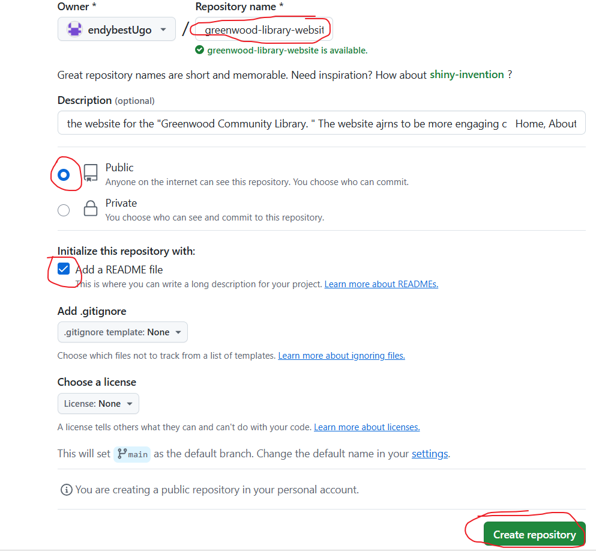
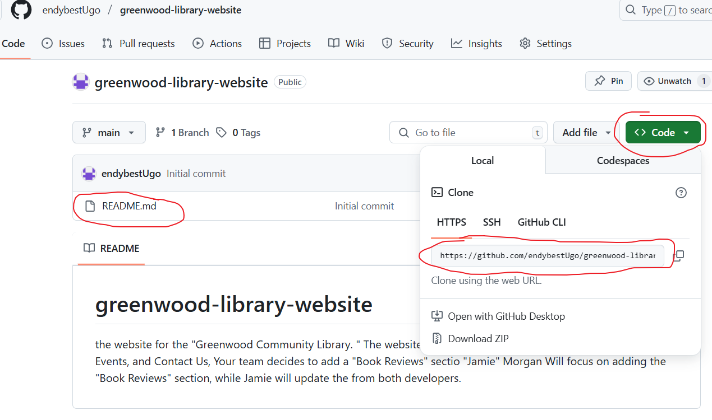
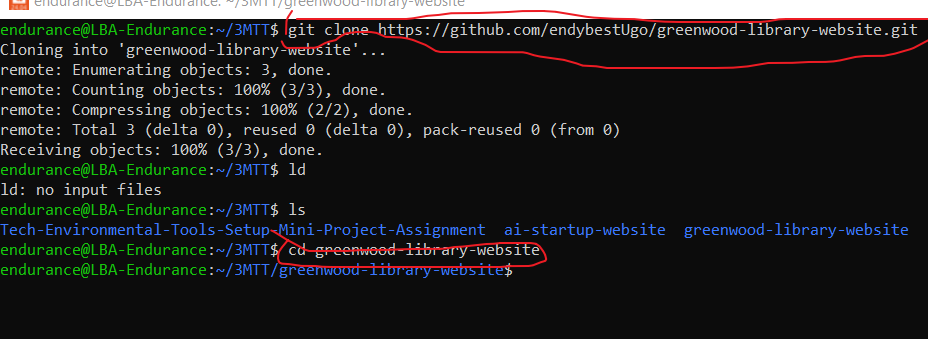
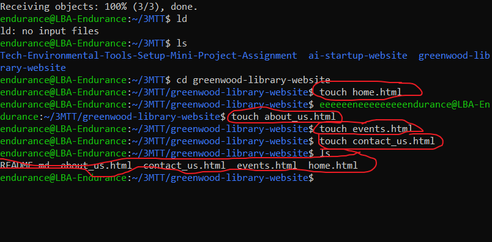
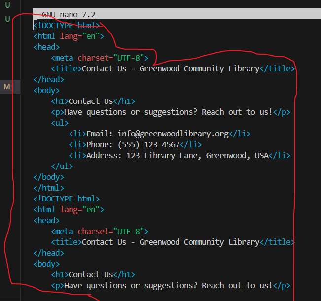
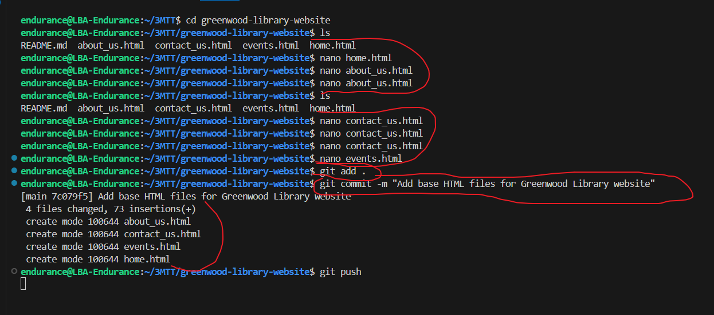
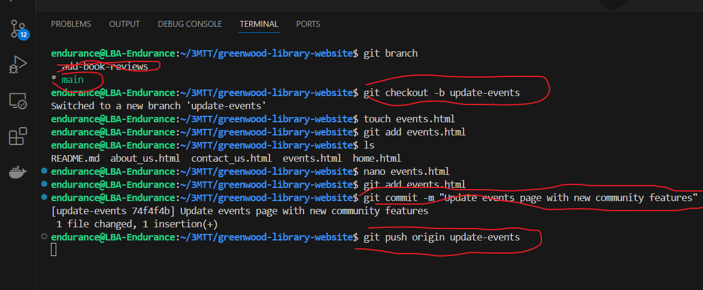

# Setup Instructions
## Create a GitHub Repository:

### Name it: greenwood-library-website

#### Clone the repository to your local machine:
[Visit Greenwood Library](https://github.com/your-username/greenwood-library-website.git)

- 

- 

## Create base HTML files in the main branch using Visual Studio Code (VS Code):

- home.html

- about_us.html

- events.html

- contact_us.html

## Add random content to each file to simulate existing content.

## Stage, commit, and push the changes:

# Merge the PR once approved.

# Morgan's Work: Add Book Reviews

# Jamie's Work: Update Events Page
- git checkout -b update-events
- git checkout update-events
  
  

    - git pull origin main
  
    - 

# Resolve any merge conflicts if they arise, then merge the PR.

